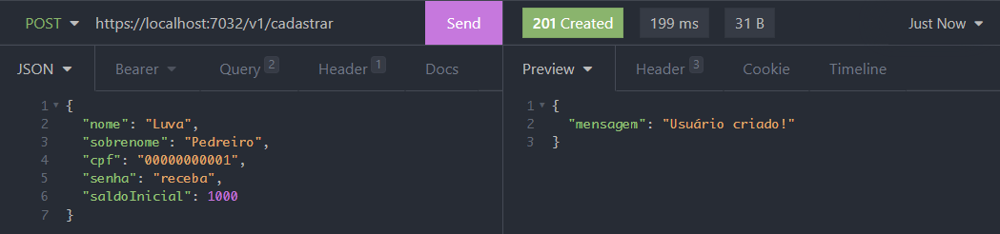
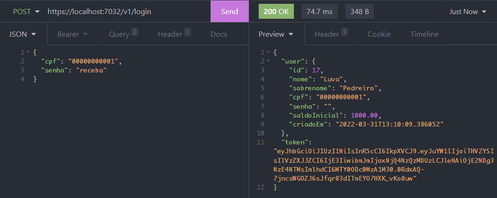
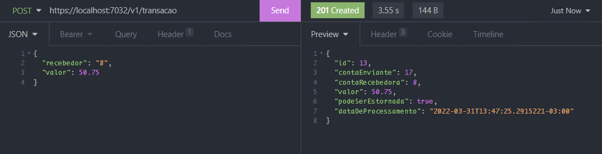
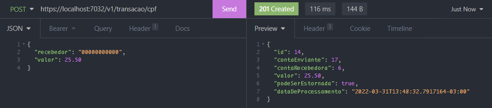
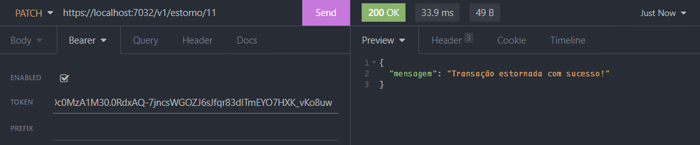
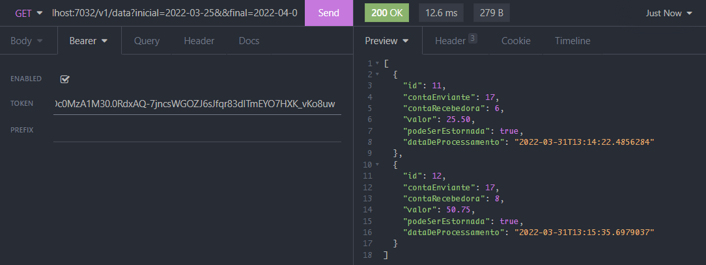
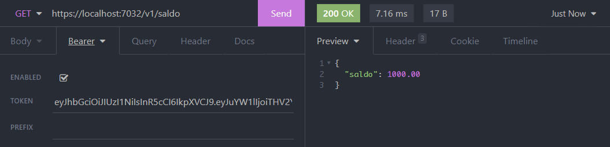

<h1 align="center"> Desafio de Programação Back-End </h1>

## Setup do projeto
- C# (_.NET_)
- SQL Server
- Entity Framework

## Instale as dependências
```
dotnet add package Microsoft.AspNetCore.Authentication
```
```
dotnet add package Microsoft.AspNetCore.Authentication.JwtBearer
```
```
dotnet add package Microsoft.EntityFrameworkCore --version 7.0.0-preview.2.22153.1
```
```
dotnet add package Microsoft.EntityFrameworkCore.SqlServer --version 7.0.0-preview.2.22153.1
```
```
dotnet add package Microsoft.EntityFrameworkCore.Design --version 7.0.0-preview.2.22153.1
```

### Para criar o banco de dados utilize:
```
dotnet ef migrations add InitialCreation
```
```
dotnet ef update database
```
### Rode o projeto com:
``` 
dotnet watch run
```

## Endpoints

### Criar usuário
Para criar um usuário, acesse o endpoint abaixo: 
<br>

**POST /v1/cadastrar**
``` json
{
	"nome": "Luva",
	"sobrenome": "Pedreiro",
	"cpf": "00000000001",
	"senha": "receba",
	"saldoInicial": 1000
}
```


### Autenticação
Para realizar o login da conta, basta acessar:
<br>

**POST /v1/login**
``` json
{
    "cpf": "00000000001",
    "senha": "receba"
}
```


Após a realização do login, todas as próximas operações necessitam do token de usuário para serem efetuadas.

### Realizar transferência
A transferência pode ser feita de duas maneiras:
- pelo Id do recebedor
- pelo CPF do recebedor
<br>

Para fazer a transação pelo Id, acesse: <br>
**POST /v1/transacao**
``` Json
{
	"recebedor": "8",
	"valor": 50.75
}
```


Para fazer a transferência pelo CPF, acesse: <br>
**POST /v1/transacao/cpf**
``` Json
{
	"recebedor": "00000000000",
	"valor": 25.50
}
```


### Estorno
Para estornar uma transferência, acesse: <br>
(Lembre de passar o id da transação)
<br>

**PATCH /v1/estorno/{id}**



### Busca de transações por data
Caso queira filtrar as transferências por data, acesse:
<br>

**GET /v1/data?inicial={dataInicial}&&final={dataFinal}**
<br>

Um exemplo pode ser:
```
/v1/data?inicial=2022-03-25&&final=2022-04-01
```



### Ver saldo
Para ver o saldo de sua conta, acesse:
<br>

**GET /v1/saldo**


